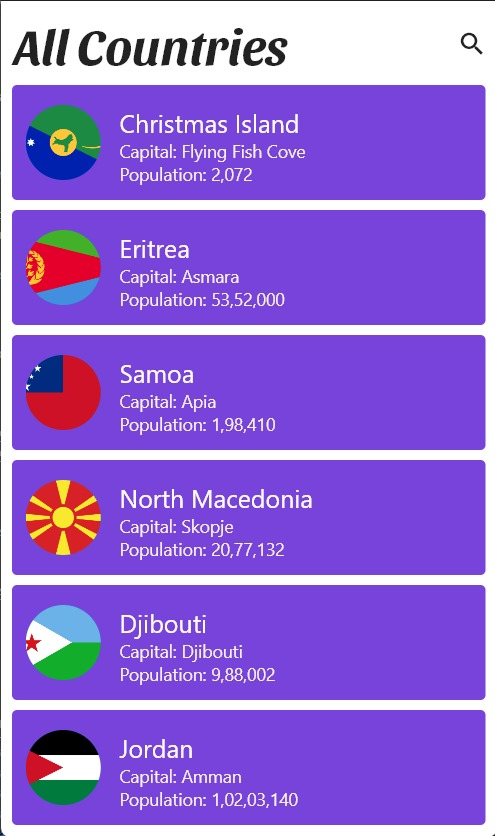

# Country House App


## Overview

Country House App is a Flutter application that allows users to search for countries and explore their details. It leverages a REST API to fetch information about countries.

## Features

- Search for countries by name
- View details of a selected country
- Access information like capital, population, languages, and more
- User-friendly interface with smooth navigation

## Technologies Used

- Flutter
- Dart
- REST API (All Countries API)

## Screenshots




## How to Run

1. Clone the repository:

   ```bash
   git clone https://github.com/ayushnaik27/country-house-app.git
2. Navigate to the project folder
   ```bash
   cd country-house-app
3. Navigate to the project folder
   ```bash
   flutter pub get
4. Navigate to the project folder
   ```bash
   flutter run
## API Used

The app uses the [All Countries API](https://restcountries.com/v3.1/all) to fetch country data.

## Contributions

Contributions are welcome! If you'd like to contribute to the project, feel free to open issues or pull requests.

